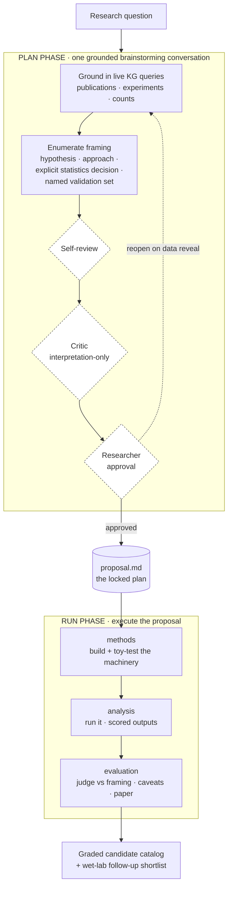

# Figure 1 — The Plan→Run arc

Draft (mermaid source). The overall workflow: a grounded Plan phase converging on
one enumerated proposal, then a Run phase of three gated milestones. Diamonds are
researcher/critic gates.

## Notes for the rendered version
- Each Run milestone expands into the co-define→do→show→explore→decide loop
  (Fig 2) with two researcher gates.
- The dashed `reopen` edge (AP → G) is the upstream-lock-edited-by-downstream-
  reveal path — instantiated in the worked example when the medium reveal reopened
  the question.
- Keep the three domain-rule anchors visible somewhere on the final figure (KG =
  sole source · locus tags not names · scripts over chat) — they underlie every box.
